  

 

---

## 🔧 Tech Stack

**Backend** 

**Cloud & Infrastructure** 

**Data & Search** 

**Observability** 

**Frontend** 

---

## 🏗 Personal Projects

### 📬 Event-Driven Notification Service with Rate Limiting
> `Java 21` `Spring Boot 3.2` `Apache Kafka` `Redis` `PostgreSQL` `Prometheus` `Docker`
> &nbsp; **[[GitHub ↗]](https://github.com/sonalisidana13/notification-service)**

Three independent microservices — `ingest → enricher → dispatcher` — with separate Kafka topics. Redis sliding window rate limiter via atomic Lua script (`EVALSHA`), partitioned by `userId/channel/tenant`. At-least-once delivery with idempotency; DLQ with exponential backoff + full jitter.

---

### 🗂 Cloud-Agnostic File Storage Microservice
> `Spring Boot 3` `PostgreSQL` `Cloudflare R2` `AWS S3` `Docker` `Flyway`
> &nbsp; **[[GitHub ↗]](https://github.com/sonalisidana13/Cloud-Agnostic-File-Storage-Microservice)** · **[[Live Demo ↗]](https://cloud-agnostic-file-storage-microse.vercel.app/)**

Pluggable `StorageProvider` abstraction (Cloudflare R2 / AWS S3) switchable via a single env var. Presigned URL flow bypasses the backend entirely. Tenant-scoped lifecycle tracking (`PENDING → UPLOADED → FAILED`) with a reconciliation poller that auto-recovers stale uploads every 60s.

---

### 🤖 AI Incident Explainer *(in progress)*
> `Java` `Elasticsearch` `Prometheus` `LLM APIs`
> &nbsp; **[[GitHub ↗]](https://github.com/sonalisidana13/Incident-Explainer)**

AI-powered tool that correlates logs and metrics to explain production incidents — RAG-based knowledge retrieval over historical incident data.

---

## 👩‍💻 About Me

Backend engineer with 6+ years building and scaling distributed systems — progressed from engineer to Tech Lead while staying hands-on in Java, Spring Boot, and AWS. I enjoy designing resilient architectures and diving deep into observability and reliability problems.

---

## 🧠 Currently Exploring

- Advanced distributed systems patterns
- AI-assisted engineering workflows
- Event-driven architecture at scale

---

## 📊 GitHub Stats

  

  
  &nbsp;&nbsp;
  

---

## 🌍 Connect

  
  &nbsp;
  
  &nbsp;
  

 

  ⭐ I build systems that <strong>scale under load, stay observable, and solve real problems.</strong>

